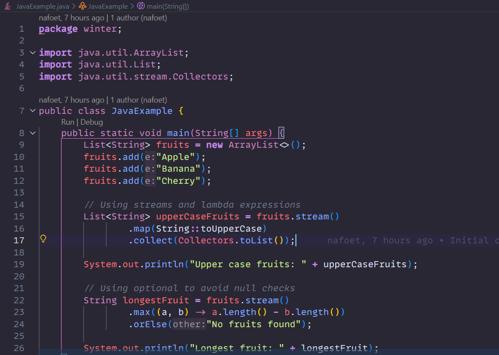
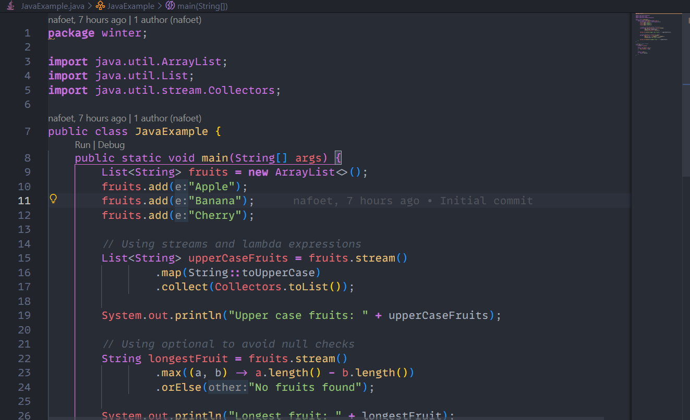
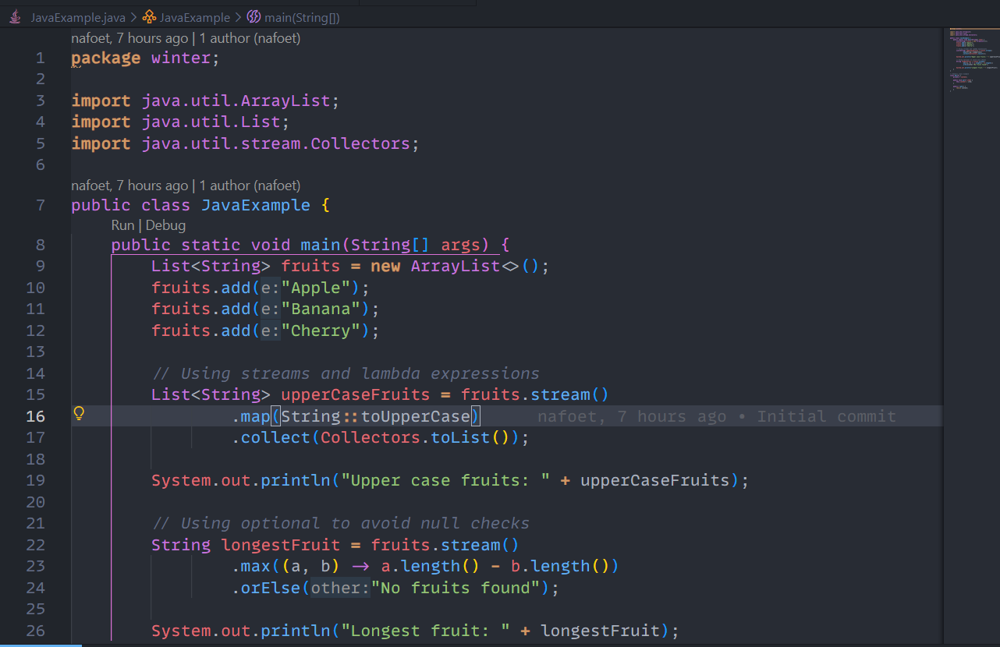
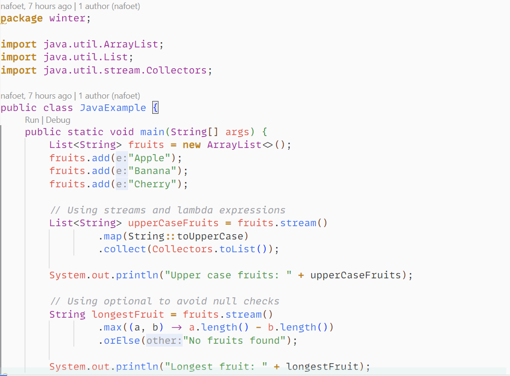
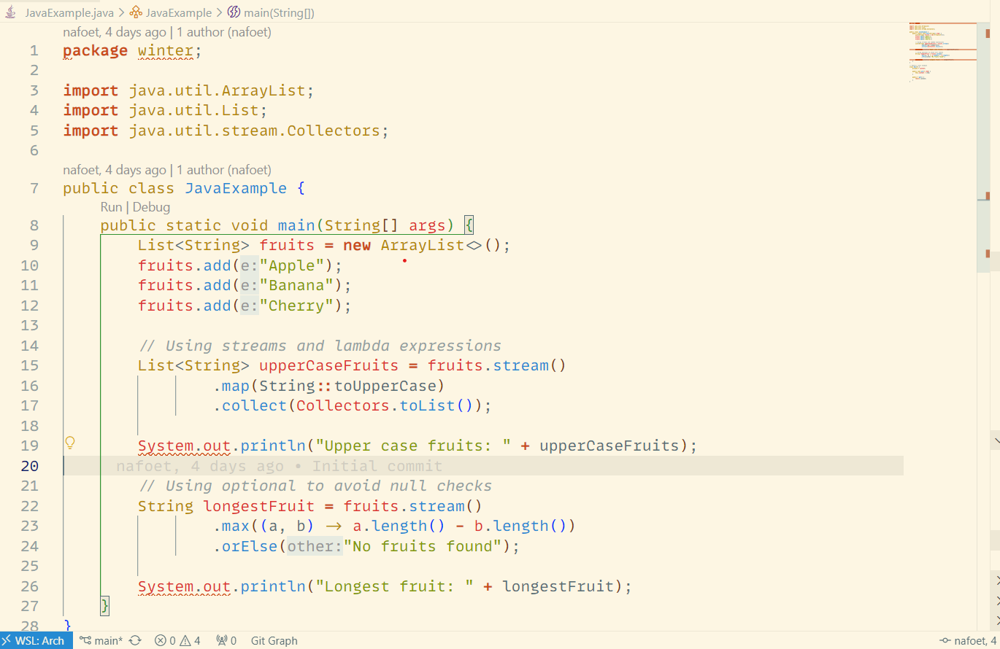

## Overview

This repository contains a collection of Visual Studio Code (VSCode) themes inspired by the themes found on [Monolisa.dev](https://monolisa.dev). The themes are designed to offer a comfortable and visually appealing coding experience with a focus on readability and a balanced color scheme.

## Themes

### Dark

1. Nafoet Dark Theme


2. Nafoet One Dark Monolisa


3. Nafoet Winter Is Coming Dark Monolisa


### Light

1. Nafoet Winter Is Coming Light Monolisa


2. Nafoet Solarized Light Monolisa


## Installation

### Download the release package

Go to the [release](https://github.com/nafoet/nafoet-themes/releases) page and download the latest release package.

You can also find the latest release on [Open-VSX](https://open-vsx.org/extension/nafoet/nafoet-themes).

Once downloaded the package:

* Open VSCode, and press Ctrl+Shift+P (or Cmd+Shift+P on Mac) to open the Command Palette.
* Search for 'Install from VSIX...'
* Choose the downloaded release package

### From the Repository

First clone the repository:

```git clone https://github.com/nafoet/nafoet-themes.git```

Then to install the themes:

* Copy the .json theme files into your VSCode extensions folder.
* Alternatively, you can use the "Import Color Theme" feature in VSCode to import the themes directly.

### Activate one of the themes

To activate and use one of the themes:

* Open VSCode, and press Ctrl+Shift+P (or Cmd+Shift+P on Mac) to open the Command Palette.
* Type Preferences: Color Theme and select your desired theme from the list.

## Contributing

Contributions are welcome! If you have suggestions, feel free to open an issue or submit a pull request.
License

This project is licensed under the MIT License. See the [LICENSE](LICENSE.md) file for details.
